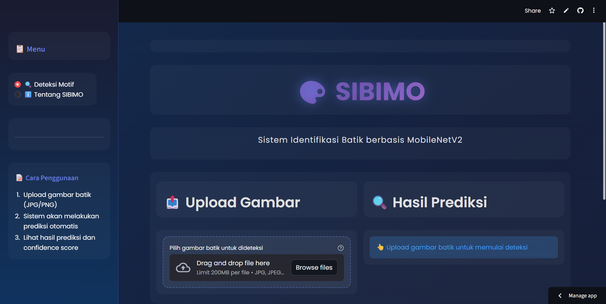
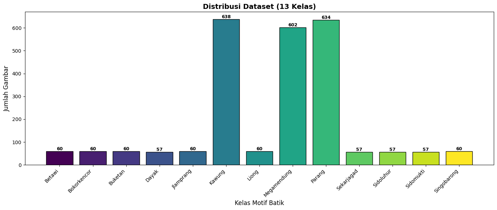
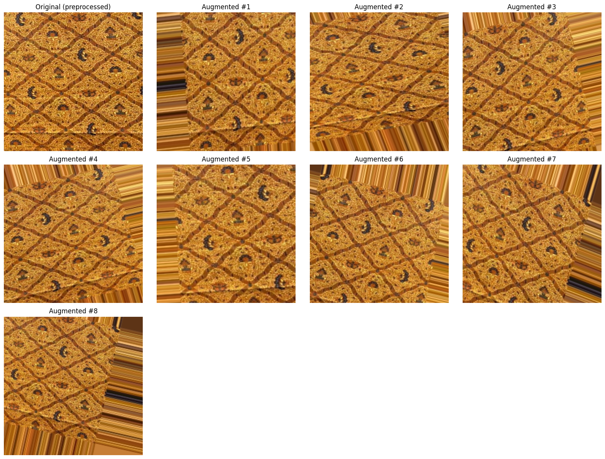
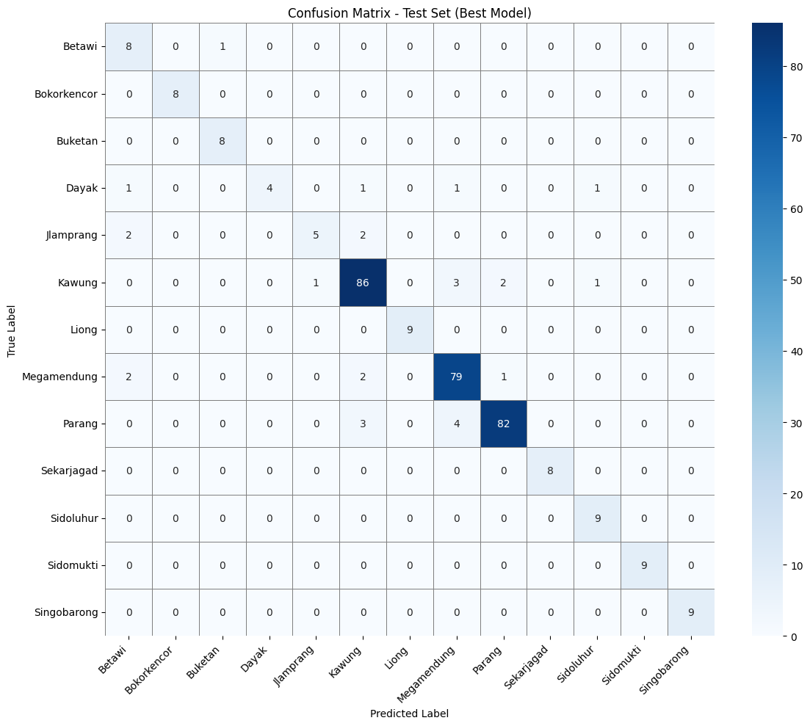

# SIBIMO — Batik Motif Classification with MobileNetV2

Sistem klasifikasi motif batik Indonesia berbasis *deep learning*, membandingkan 4 metode *hyperparameter tuning* × 4 *optimizer* untuk menemukan konfigurasi training terbaik, lalu dideploy jadi web app siap pakai.

🔗 **Live demo:** [SIBIMO on Streamlit](https://app-app-dkgt3s4zmwem8sfk8flbva.streamlit.app/)



---

## Overview

Klasifikasi motif batik secara visual itu susah — motif seperti Kawung, Parang, dan Mega Mendung punya kemiripan tekstur dan struktur geometris yang tinggi. Project ini membangun model klasifikasi **13 motif batik** menggunakan **MobileNetV2** (transfer learning), dengan fokus utama pada perbandingan sistematis metode *hyperparameter tuning* dan *optimizer*, bukan cuma asal training satu model.

**Hasil akhir:** kombinasi **Bayesian Optimization + Adam** memberikan performa terbaik — akurasi data uji **92.05%**, dengan *weighted F1-score* **0.919**.

---

## Key Results

| Metric | Train Set | Test Set |
|---|---|---|
| Accuracy | 99.64% | 92.05% |
| Weighted Precision | 0.9961 | 0.9254 |
| Weighted Recall | 0.9964 | 0.9205 |
| Weighted F1-score | 0.9964 | 0.9192 |

Konfigurasi terbaik: `learning_rate=0.001`, `batch_size=32`, `dropout_rate=0.2`, optimizer **Adam**, ditemukan lewat **Bayesian Optimization** (mean validation accuracy 90.85%, validation loss 0.3812).

---

## Dataset

2.462 citra batik dari 13 kelas, digabung dari 2 dataset publik Kaggle (BatikSnap, Batik Indonesia) + tambahan hasil pencarian Google Images untuk melengkapi variasi.



| Sumber | Jumlah Kelas | Catatan |
|---|---|---|
| [BatikSnap Dataset](https://kaggle.com/datasets/syahdanputra/batiksnapdataset) | 3 kelas utama | Kawung, Parang, Mega Mendung |
| [Batik Indonesia Dataset](https://kaggle.com/datasets/hydiexe/dataset-fix) | 10 kelas tambahan | Betawi, Bokor Kencor, Buketan, Dayak, Jlamprang, Liong, Singo Barong, Sekar Jagad, Sido Luhur, Sido Mukti |
| Google Images (manual) | 3 kelas utama | Menambah variasi & jumlah citra |

> Dataset penuh tidak disertakan di repo ini (ukuran besar + sebagian dikumpulkan manual dari internet). Lihat [Dataset Sources](#dataset) di atas untuk mengunduh dataset publiknya, atau cek folder `sample_images/` untuk contoh tiap kelas.

---

## Methodology

1. **Preprocessing** — resize 224×224, normalisasi, tetap RGB (warna adalah fitur penting motif batik)
2. **Data Augmentation** — rotation, horizontal flip, width/height shift, zoom

   

3. **Iterative Stratified Sampling** — 5 iterasi, tiap iterasi sampling 75% dari train-val pool, split 80:20 stratified, test set dikunci di awal
4. **Two-Phase Training** — Phase 1 (*transfer learning*, base frozen) → Phase 2 (*fine-tuning*, sebagian layer base di-unfreeze)
5. **Hyperparameter Tuning** — 4 metode (*Grid Search*, *Random Search*, *Bayesian Optimization*, *Particle Swarm Optimization*) × 4 optimizer (Adam, SGD, RMSprop, Adagrad), mencari kombinasi `learning_rate`, `batch_size`, `dropout_rate` terbaik

---

## Tech Stack

- **TensorFlow / Keras** — model development & training
- **MobileNetV2** — transfer learning backbone
- **Keras Tuner** — implementasi Bayesian Optimization
- **scikit-learn** — evaluasi metrik, stratified split
- **Streamlit** — deployment web app

---

## Project Structure

```
batik-motif-classification/
├── notebooks/
│   ├── 01_training_phase1.ipynb        # Preprocessing, augmentation, two-phase training
│   └── 02_hyperparameter_tuning.ipynb  # Grid/Random/Bayesian/PSO tuning + evaluasi
├── assets/
│   ├── dataset_distribution.png
│   ├── augmentation_example.png
│   ├── confusion_matrix_train.png
│   ├── confusion_matrix_test.png
│   └── sibimo_ui.png
├── sample_images/                      # Contoh 2-3 gambar per kelas (opsional)
├── docs/
│   └── Laporan_Skripsi.pdf             # (opsional)
├── requirements.txt
├── .gitignore
├── LICENSE
└── README.md
```

---

## Getting Started

```bash
# Clone repo
git clone https://github.com/MRafli43/batik-motif-classification.git
cd batik-motif-classification

# Install dependencies
pip install -r requirements.txt

# Jalankan notebook
jupyter notebook notebooks/01_training_phase1.ipynb
```

---

## Results — Evaluation



Model tampil sangat baik pada kelas minor seperti Bokor Kencor, Liong, Sekar Jagad, Sido Mukti, dan Singo Barong (precision & recall 1.00). Kesalahan klasifikasi utama terjadi pada motif **Betawi**, **Dayak**, dan **Jlamprang** yang punya kemiripan struktur visual dengan kelas lain.

---

## License

MIT License — bebas dipakai untuk pembelajaran, silakan cantumkan atribusi jika digunakan.

## Acknowledgment

Project ini merupakan bagian dari Tugas Akhir (Skripsi) di Program Studi Sains Data, Universitas Pembangunan Nasional Veteran Jawa Timur.
